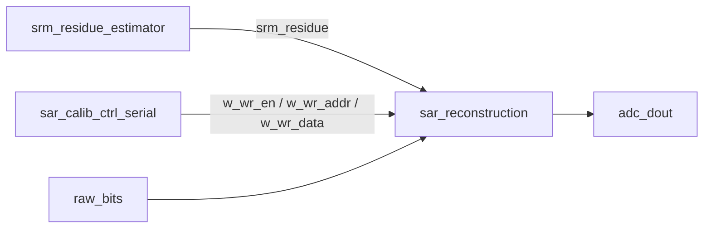

# Architecture

## Active Digital Reproduction Scope

The active project now keeps three digital blocks that reproduce the digital
algorithm boundary described in the Huang split-sampling SAR ADC work:

## Calibration Core

`sar_calib_ctrl_serial` implements foreground recursive bit-weight calibration.
It uses the trusted 6-bit LSB section as the reference DAC, measures each upper
bit in positive and negative directions to cancel input-referred offset, averages
the measured results, and writes calibrated weights to the reconstruction RAM.

The high-bit protection logic reproduces the thesis description for the top two
calibrated bits: when calibrating the highest physical bits, lower protection
bits are forced to keep the DAC top-plate swing inside range.

## Reconstruction Core

`sar_reconstruction` converts SAR decision bits to a signed 16-bit output using
calibrated capacitor weights. The output path is:

1. Weighted differential sum of raw SAR decisions.
2. Divide by two for differential normalization.
3. Add SRM residue correction in the same fixed-point weight domain.
4. Round and saturate to signed 16-bit output.

## SRM Digital Estimator

`srm_residue_estimator` implements the digital side of statistical residue
measurement. It counts 22 extra noisy comparator decisions and maps the count to
a signed residue correction with a fixed normal-inverse LUT. The analog latch
noise and residue-to-probability behavior are modeled in testbench space; the RTL
block covers the reproducible digital counter and lookup behavior.

## Archive Boundary

Non-active wrappers, old top-level integration, legacy Vivado projects, MATLAB
scripts, generated LUTs, and previous duplicate implementations are preserved
under `archive/`. They are not referenced by the active Vivado project.
