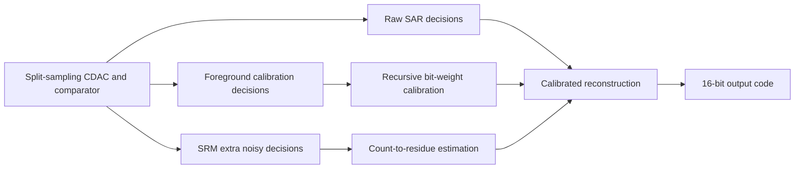
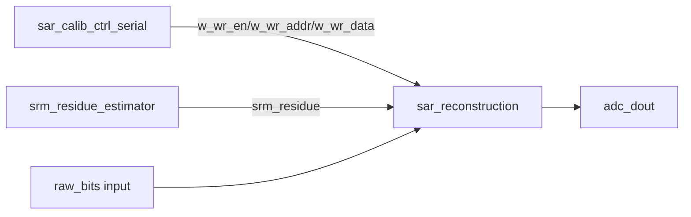

# 原算法差异与复现距离技术详析

日期：2026-05-18

本文档面向工程维护和学术复现，专门回答一个核心问题：

> 当前 `sar_adc_v3` 交付包到底复现了 Huang split-sampling SAR ADC 算法的哪些技术细节？哪些地方只是数字边界近似？距离原论文/原同学完整系统还有多远？

结论先行：当前工程已经比较完整地复现了**可由纯数字 RTL 表达的算法边界**，包括前台 bit-weight calibration controller、SRM count-to-residue estimator、calibrated digital reconstruction。但是它没有、也不应该声称已经复现 split-sampling SAR ADC 的完整模拟前端、采样网络、comparator/latch 物理噪声、clock multiplier、版图寄生、PVT 与 mixed-signal signoff。

## 1. 复现对象分层

Huang 的系统可以分成三层：

| 层级 | 原算法/原系统内容 | 当前工程状态 |
| --- | --- | --- |
| Analog front-end | split sampling CDAC、bootstrapped sampling、comparator/latch、autozero、DAC settling、驱动负担降低机制 | 未做晶体管级/电荷级复现，只在 TB 中用行为模型提供 comparator decision |
| Mixed-signal algorithm boundary | bit-weight calibration、SRM extra comparator decisions、residue-to-probability 关系 | 部分复现，模拟侧被抽象成 real-valued CDAC、offset/noise 与 decision stream |
| Digital backend | calibration FSM、weight writeback、SRM count/LUT、fixed-point reconstruction、round/saturation | RTL 已实现并经 XSIM + synthesis 验证 |

因此，当前项目的准确定位是：

```text
digital algorithm reproduction core
not full ADC chip reproduction
not final FPGA board bitstream
not ASIC tapeout database
```

## 2. 原算法数字链路的技术抽象

从论文/博士论文中可抽取的数字算法链路如下：



当前 RTL 实际实现的是：



差异的本质是：原系统的左侧模拟物理过程被抽象为 TB 输入或行为模型；右侧数字计算过程被保留下来并 RTL 化。

## 3. 前台 bit-weight calibration 的复现细节

### 3.1 原算法意图

原算法要解决的是 split/non-binary capacitor array 的真实 bit weight 与理想权重不同的问题。由于高位 capacitor mismatch 对高分辨率 SAR ADC 的 INL/SNDR 影响很大，系统需要测量并存储真实权重。

关键思想：

1. 低位 LSB section 作为可信 reference DAC。
2. 从第一个需要校准的高位开始，逐位递归测量。
3. 测量目标 bit 时，用已经校准好的低位组合去逼近它。
4. 做正向/反向两个方向的测量，抵消 comparator/preamp offset。
5. 对测量结果重复平均，降低 comparator noise 对结果的影响。
6. 最高几位使用保护/补偿 switching，避免 DAC top-plate swing 或 common-mode 超出可用范围。

### 3.2 当前 RTL 实现

对应 RTL：`sar_calib_ctrl_serial.sv`

核心参数：

| 参数 | 当前值 | 技术含义 |
| --- | ---: | --- |
| `CAP_NUM` | 20 | capacitor decision/weight 数量 |
| `MAX_CALIB_BIT` | 5 | bit 0 到 bit 5 被视为可信 LSB reference |
| `AVG_LOOPS` | 32 | 每个 bit 重复测量 32 次 |
| `COMP_WAIT_CYC` | 16 | 每次 DAC force 后等待 comparator/DAC settling 的数字周期 |
| `WEIGHT_WIDTH` | 30 | calibrated weight 固定点宽度 |
| `REF_WEIGHT_LSB` | 256 | bit 0 的 Q8 reference weight |

FSM 顺序：

```text
S_IDLE
S_INIT_TARGET
S_PHASE_P_SETUP -> S_PHASE_P_SAR -> S_PHASE_P_CALC
S_PHASE_N_SETUP -> S_PHASE_N_SAR -> S_PHASE_N_CALC
S_ACCUMULATE
S_UPDATE_WEIGHT
S_DONE
```

对每个目标 bit `k`：

1. Phase P：强制目标 bit 到 P-side，低位搜索码到 N-side。
2. Phase N：方向反过来，低位搜索码到 P-side，目标 bit 到 N-side。
3. 每个 phase 内用 SAR-style binary search 确定低位组合。
4. `S_PHASE_*_CALC` 中串行累加 `shadow_weights[calc_cnt]`，得到测量值。
5. `S_ACCUMULATE` 累加 `meas_val_p + meas_val_n`。
6. 重复 `AVG_LOOPS` 次后，在 `S_UPDATE_WEIGHT` 计算：

```text
calc_result = round(accumulator / (2 * AVG_LOOPS))
```

代码表达为：

```systemverilog
assign calc_result_wire = (accumulator + (1 << AVG_SHIFT)) >>> (AVG_SHIFT + 1);
```

其中 `AVG_SHIFT = log2(AVG_LOOPS)`，`+1` 是因为 P/N 两个方向都被累加。

### 3.3 与原算法一致的地方

| 原算法点 | 当前复现情况 |
| --- | --- |
| 低位 reference DAC | bit 0..5 reset 为 `256 << i`，作为 `shadow_weights` 初值 |
| 逐位递归 | `target_bit` 从 6 递增到 19 |
| P/N offset cancellation | `meas_val_p + meas_val_n` 后除以 2 |
| 多次平均 | `AVG_LOOPS = 32` |
| weight writeback | `w_wr_en/w_wr_addr/w_wr_data` 输出给 reconstruction |
| 递归依赖 | 更新 `shadow_weights[target_bit]` 后供更高 bit 使用 |
| top-bit protection | target bit 18/19 时强制保护位并做 digital restoration |
| timing-friendly implementation | 低位组合求和被放到 `S_PHASE_*_CALC` 串行执行，避免大组合加法树 |

### 3.4 与原算法/真实芯片的距离

| 项目 | 当前工程 | 原系统/真实芯片需要 |
| --- | --- | --- |
| CDAC 物理行为 | TB 中用 real-valued `phy_weights[]` 模拟 | 真实 capacitor array、寄生、电荷注入、settling |
| comparator offset | TB 固定 `OFFSET_LSB = 5.0` | offset 分布、温漂、input common-mode 依赖 |
| comparator noise | TB 用 `NOISE_RMS_LSB = 0.5` Gaussian noise | 真实 latch/preamp noise，可能非 Gaussian、相关、随时间变化 |
| DAC settling | RTL 只等待 `COMP_WAIT_CYC` | analog settling time、residue memory、kickback |
| P/N offset cancellation | 数字结构保留 | 真实 offset cancellation 效果取决于开关对称性和 analog path matching |
| top-bit protection | 逻辑等效地强制 bit 17/18 | 原芯片实际 switching matrix、common-mode trajectory 还需 analog 验证 |
| Monte Carlo 覆盖 | 5 个 deterministic seeds | 大规模 mismatch/noise/PVT/statistical yield |

复现距离判断：**数字控制算法复现度高，模拟物理统计复现度中等偏低**。当前 TB 证明“在指定行为模型下算法能工作”，但不能证明“真实 silicon 上在所有 PVT/noise/mismatch 下必然达标”。

## 4. `tb_gain_comp_check_lsb` 与真实 calibration 的差异

当前 calibration TB 的 analog model：

```text
phy_weights[i] = ideal_weight_lsb(i) * 256 * (1 + mismatch)
```

mismatch 设置：

| bit range | TB mismatch sigma |
| --- | ---: |
| bit 0..5 | 0.15% |
| bit 6..19 | 3.00% |

comparator model：

```text
comp_out = ((Vp - Vn) + OFFSET_LSB * 256 + noise_q) > 0
```

其中：

```text
OFFSET_LSB = 5.0
NOISE_RMS_LSB = 0.5
AVG_LOOPS = 32
MC_RUNS = 5
```

技术含义：

- 这是一个**算法验证模型**，不是 transistor-level comparator。
- 它验证 offset 存在、noise 存在、capacitor mismatch 存在时，P/N measurement + average + gain compensation 能否恢复权重。
- 它没有模拟 comparator metastability、kickback、input-dependent offset、DAC incomplete settling、采样瞬态等。

当前结果：

| Run | max residual error |
| --- | ---: |
| 0 | `0.3864 LSB` |
| 1 | `0.3797 LSB` |
| 2 | `0.3425 LSB` |
| 3 | `0.2807 LSB` |
| 4 | `0.4937 LSB` |

关键判断：

```text
worst margin = 0.5 - 0.4937 = 0.0063 LSB
```

这说明当前 5 个 seed 在阈值内通过，但最坏 run 很贴边。工程上不能把这个结果解释为大规模 yield 已经可靠，只能解释为：

> 在当前行为模型、当前 5 个 deterministic seeds、当前 offset/noise 参数下，数字校准算法可把 bit 6..19 的 residual bit-weight error 压到 0.5 LSB 以下。

如果要更接近原论文统计意义，需要增加：

- 100 到 1000+ Monte Carlo seeds；
- 多组 `OFFSET_LSB`；
- 多组 `NOISE_RMS_LSB`；
- DAC settling error；
- comparator decision correlation；
- 温度、电压、工艺 corner；
- 不同 capacitor mismatch profile；
- 与 MATLAB 或 mixed-signal 仿真结果交叉对照。

## 5. SRM residue estimator 的复现细节

### 5.1 原算法意图

SRM 的核心思想是：正常 SAR conversion 结束后，模拟 residue 仍然包含有关输入误差的信息。通过让 noisy comparator/latch 对同一个 residue 进行多次额外 decision，可以把“1 的比例”看成 residue polarity/magnitude 的统计信息。

抽象关系：

```text
p = P(comparator outputs 1 | residue, noise_sigma)
residue = sigma * inverse_normal_cdf(p)
```

原系统中，`p` 来自真实 comparator/latch 的随机 decision；数字端只需要计数和查表。

### 5.2 当前 RTL 实现

对应 RTL：`srm_residue_estimator.sv`

参数：

```text
DECISION_COUNT = 22
RESIDUE_WIDTH  = 30
FRAC_BITS      = 8
```

当前 LUT 构造方式：

```text
p(c) = (c + 0.5) / 23, c = 0..22
residue_q8 = round(0.5 * normal_inverse_cdf(p) * 2^8)
```

输出 LUT：

```text
c=0  -> -258
c=1  -> -194
c=2  -> -158
c=3  -> -131
c=4  -> -110
c=5  -> -91
c=6  -> -74
c=7  -> -58
c=8  -> -43
c=9  -> -28
c=10 -> -14
c=11 -> 0
c=12 -> 14
c=13 -> 28
c=14 -> 43
c=15 -> 58
c=16 -> 74
c=17 -> 91
c=18 -> 110
c=19 -> 131
c=20 -> 158
c=21 -> 194
c=22 -> 258
```

技术细节：

- `+0.5` 是 finite-count smoothing，避免 `c=0` 或 `c=22` 对应 `p=0/1` 时 inverse CDF 发散。
- LUT 假设 noise sigma 为 `0.5 LSB`。
- LUT 是 signed Q8，`FRAC_BITS` 允许重定标到 reconstruction fixed-point domain。
- RTL 只做 digital count + LUT，不生成随机 decision。

### 5.3 与原算法一致的地方

| 原算法点 | 当前复现情况 |
| --- | --- |
| 额外 comparator decision 数量 | 固定 22 次 |
| count of ones | `ones_count` |
| done handshake | 第 22 个 accepted decision 后 `done` pulse |
| probability-to-residue | inverse-normal LUT |
| residue 接入位置 | reconstruction rounding 前注入 |

### 5.4 与真实 SRM 的距离

| 项目 | 当前工程 | 原系统/真实芯片需要 |
| --- | --- | --- |
| noisy decision 来源 | TB 或上层输入 `decision_bit` | 真实 latch/comparator noise |
| noise sigma | 固定假设 `0.5 LSB` | silicon 中需标定或设计保证 |
| decision 独立性 | 默认每次 decision 独立 | 真实 latch 可能有相关噪声、记忆效应 |
| residue 固定性 | 数字端假设 22 次 decision 看到同一 residue | 真实电路存在 leakage、settling、kickback |
| LUT 精度 | 23 点离散 LUT | 可按论文/实测噪声重新生成、提高位宽或做插值 |
| TB 覆盖 | 当前检查边界/中心/对称点 | 若要 bit-exact signoff，可增加 0..22 全覆盖 |

复现距离判断：**SRM 的数字 count/LUT 边界复现度高；SRM 的模拟统计来源没有复现，只被参数化假设代替。**

## 6. Digital reconstruction 的复现细节

### 6.1 原算法意图

SAR conversion 只产生 raw decisions。若 capacitor weights 非理想，不能简单按 binary code 解释，而要用 calibrated weight 做 weighted sum。

理想数字结构：

```text
sum = Σ sign(raw_bit[i]) * calibrated_weight[i]
code = normalize(sum + residue_correction)
```

### 6.2 当前 RTL 实现

对应 RTL：`sar_reconstruction.sv`

核心数据流：

```text
raw_bits + weight_ram
    -> 4 group partial sums
    -> global sum_stage2
    -> differential divide-by-2
    -> add srm_residue
    -> add 0.5 LSB rounding
    -> arithmetic right shift by FRAC_BITS
    -> signed 16-bit saturation
```

每个 bit 的 contribution：

```systemverilog
if (raw_bits[idx])
    acc_group += weight_ram[idx];
else
    acc_group -= weight_ram[idx];
```

输出固定点：

```text
val_step1 = (sum_stage2 >>> 1) + srm_residue
val_step2 = val_step1 + 2^(FRAC_BITS - 1)
val_step3 = val_step2 >>> FRAC_BITS
adc_dout  = saturate_to_int16(val_step3)
```

### 6.3 与原算法一致的地方

| 原算法点 | 当前复现情况 |
| --- | --- |
| calibrated weight reconstruction | `weight_ram[]` 存储校准权重 |
| raw decision signed contribution | raw bit 选择 `+weight` 或 `-weight` |
| differential normalization | `sum_stage2 >>> 1` |
| SRM residue correction | `srm_residue` 在 rounding 前加入 |
| fixed-point rounding | 加 `0.5 LSB` 后 arithmetic shift |
| output protection | signed 16-bit saturation |
| timing optimization | 20 项求和拆成 4 组 partial sum + global sum |

### 6.4 与真实系统的距离

| 项目 | 当前工程 | 原系统/真实芯片需要 |
| --- | --- | --- |
| raw SAR decisions | TB 直接生成或输入 | 完整 SAR sequencer、comparator timing、bit cycling |
| weight update | 简单同步 write port | 系统寄存器、校准/转换 mode arbitration |
| valid timing | 2-stage pipeline valid | 与真实采样率、latency、后端 bus 对齐 |
| overflow/saturation | int16 clamp | 系统级 clipping policy、digital output format |
| SRM coupling | `srm_residue` 直接输入 | SRM phase 调度、residue hold、decision capture |

复现距离判断：**数字 reconstruction 公式与 fixed-point 边界复现度高；完整 ADC conversion control 和系统时序未复现。**

## 7. 当前代码与原 MATLAB/论文模型的差异

归档中仍保留旧 MATLAB：

```text
archive/deleted-in-039c478/matlab/
archive/deleted-in-039c478/archive/legacy_vivado_projects/
```

当前 RTL 与 MATLAB/论文模型的主要差异：

| 维度 | MATLAB/论文模型常见表达 | 当前 RTL 表达 |
| --- | --- | --- |
| 数据类型 | double/real，可直接计算连续量 | fixed-point signed integer |
| 算法阶段 | 可在一个脚本中混合 analog + digital | 分成 calibration / SRM / reconstruction 三个 RTL block |
| LUT 生成 | 可调用 erf/erf_inv/normal inverse | 固化 23 项 signed Q8 LUT |
| 平均与舍入 | 浮点平均 | `(accumulator + rounding) >>> shift` |
| CDAC 行为 | 可用向量/矩阵一次性计算 | TB 中 real model，RTL 只输出 DAC force bits |
| comparator | 可直接比较带噪 real 值 | RTL 只采样 1-bit `comp_out` |
| 验证方式 | 脚本绘图/统计 | XSIM transcript PASS/FAIL + `$fatal` |

这类差异是从学术模型落到 RTL 时必须出现的，不是 bug。但每个 fixed-point 取整点都需要被明确记录，因为它们会影响 bit-accurate 结果。

## 8. 当前复现可信度分级

| 功能 | 当前可信度 | 理由 |
| --- | --- | --- |
| `srm_residue_estimator` 计数状态机 | 高 | 小状态机，XSIM 覆盖边界/中点/对称，综合资源很小 |
| SRM LUT 符号和尺度 | 中高 | LUT 公式明确，但 TB 尚未 exhaustively check 0..22 全部 count |
| `sar_reconstruction` fixed-point datapath | 高 | 48 checks 覆盖线性、权重更新、throughput、SRM 注入 |
| calibration FSM 流程 | 中高 | Monte Carlo TB 覆盖核心流程，综合通过 |
| calibration analog robustness | 中低 | 只有 5 seeds，最坏 residual 距阈值只差 0.0063 LSB |
| FPGA 上板可用性 | 中 | 单元综合通过，但缺完整 wrapper/XDC/I/O timing |
| ASIC tapeout readiness | 低 | 缺 lint/CDC/STA/DFT/GLS/formal/mixed-signal signoff |

## 9. 技术风险清单

### 9.1 最贴近阈值的风险

`tb_gain_comp_check_lsb` worst residual error：

```text
0.4937 LSB < 0.5 LSB
```

余量：

```text
0.0063 LSB
```

这不是失败，但说明当前 Monte Carlo 设置下存在贴边 case。建议后续把 TB 从 5 seeds 扩展到更多 seeds，并把 worst-case seed 固定记录。

### 9.2 SRM sigma 假设风险

SRM LUT 固定假设：

```text
sigma = 0.5 LSB
DECISION_COUNT = 22
FRAC_BITS = 8
```

如果真实 comparator noise sigma 不是 0.5 LSB，当前 LUT 会产生系统性 residue scale error。后续应根据 analog simulation 或 silicon characterization 重新生成 LUT。

### 9.3 `comp_out` 同步风险

`sar_calib_ctrl_serial` 当前只打一拍：

```systemverilog
comp_out_r <= comp_out;
```

若真实 comparator decision 与 `clk` 异步，单拍寄存器不能等价于完整 CDC 解决方案。需要系统 wrapper 明确 comparator valid window，或者用同步/握手机制保证采样稳定。

### 9.4 top-bit protection 等效性风险

RTL 对 bit 18/19 做 protection：

```text
target 18: force bit 17, compensate weight[17]
target 19: force bit 18 and bit 17, compensate weight[18] + weight[17]
```

这在数字层面复现了“限制高位校准摆幅并数字恢复”的思想；但真实 switching matrix、common-mode 轨迹和 CDAC top-plate voltage 是否完全等效，需要 analog 仿真确认。

## 10. 建议的下一步技术增强

按优先级排序：

1. **SRM LUT exhaustive TB**：把 `tb_srm_residue_estimator` 扩展到 count 0..22 全覆盖。
2. **Calibration Monte Carlo 扩展**：从 5 seeds 扩展到至少 100 seeds，并输出 worst seed。
3. **Parameter sweep**：扫描 `OFFSET_LSB`、`NOISE_RMS_LSB`、mismatch sigma。
4. **Reconstruction corner cases**：增加 all-zero/all-one、saturation、random weight perturbation。
5. **Wrapper-level timing contract**：定义 `comp_out`、SRM decision、raw SAR bits 的 valid/settle 时序。
6. **LUT generation script**：恢复或重写 SRM LUT generator，并把 sigma/decision_count/version 写入 manifest。
7. **Mixed-signal co-sim plan**：把 analog comparator/CDAC 的仿真结果转成 digital TB stimulus。
8. **ASIC lint/CDC/formal**：对三个 active RTL 跑真实 ASIC front-end 工具。

## 11. 最终技术判断

当前工程距离原算法的“数字核心”已经很近，原因是：

- calibration FSM 的递归、P/N offset cancellation、averaging、writeback、top-bit protection 都有 RTL 表达；
- reconstruction 的 fixed-point weight sum、SRM injection、rounding、saturation 都有明确实现；
- SRM 的 22-decision count-to-residue LUT 已经 RTL 化；
- 三个核心模块均通过 XSIM，且 standalone synthesis 通过。

当前工程距离原论文/原芯片的“完整系统”仍有明确距离，原因是：

- split-sampling analog front-end 未复现；
- comparator/latch 的真实 noise/offset/statistical behavior 只用 TB 参数近似；
- CDAC settling、charge injection、common-mode、PVT、layout parasitic 没有进入 RTL；
- FPGA/ASIC 系统级 wrapper、I/O timing、CDC/RDC、DFT、STA、GLS 尚未建立。

最准确的归档描述应为：

> 本项目已经完成 Huang split-sampling SAR ADC 数字算法边界的工程化复现，而不是完成整个 ADC 芯片的 mixed-signal 复现。当前 RTL/TB 适合作为后续 FPGA integration、mixed-signal co-simulation 和 ASIC signoff 的数字核心基线。
