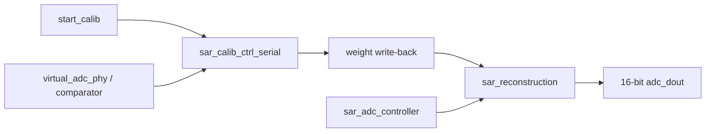

# 架构说明

## 系统分层

## 校准链路

`sar_calib_ctrl_serial` 负责前景递归校准。它从 `MAX_CALIB_BIT + 1` 开始校准高位电容，低 6 位作为可信基准段。每个目标 bit 执行 P 相和 N 相测量，然后对两相结果做平均，最后通过写回接口更新外部重构权重和内部 shadow weights。

本次重构将以下逻辑工程化：

- 计数器宽度由参数推导，减少固定宽度假设。
- MSB 保护位由 `CAP_NUM` 推导，不再散落硬编码 `18/19/17/16`。
- 补偿结果集中在 `compensated_meas`，P/N 相复用同一处补偿逻辑。
- 低位参考权重通过 `REF_WEIGHT_LSB` 与 `MAX_CALIB_BIT` 统一初始化。

## 重构链路

`sar_reconstruction` 接收 SAR 原始码和校准权重，使用两级流水线求和：

1. Stage 1 将 20 位输入分组，形成 partial sums。
2. Stage 2 汇总 partial sums。
3. 输出级做除 2、四舍五入、移位和 16-bit 饱和。

本次重构把低 6 位权重的初始化放进 reset path，避免 `tb_sar_adc_top` 直接写 `u_recon.weight_ram[0:5]`。这让行为更接近真实硬件，也降低测试平台和 DUT 的耦合。

## 仿真 AFE 模型

`virtual_adc_phy` 用固定权重表模拟电容阵列，组合计算 P/N 电压并在时钟边沿给出比较器输出。本次重构后，端口宽度、权重数组和循环边界都跟随 `CAP_NUM`，默认仍保持 20-bit 权重表。

## 顶层关系

活动综合顶层仍是 `fpga_top_wrapper`。它实例化：

- `sar_calib_ctrl_serial`
- `virtual_adc_phy`

系统级验证顶层 `tb_sar_adc_top` 额外实例化：

- `sar_adc_controller`
- `sar_reconstruction`
- `virtual_adc_phy`
- `sar_calib_ctrl_serial`
