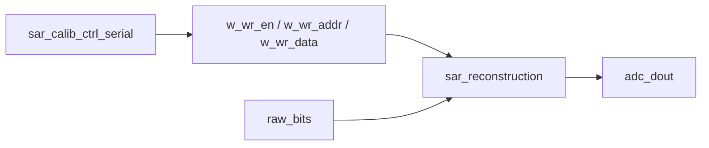

# Architecture

## Minimal Scope

当前主线只维护两个独立数字模块：

## Calibration Core

`sar_calib_ctrl_serial` 负责前景递归电容权重校准。它保留完整 DAC force、比较器反馈、P/N 两相测量、串行累加和权重写回接口。

本轮进一步去重：

- P/N 相 setup/SAR/calc 顺序逻辑已经合并。
- P/N 相 DAC drive 镜像逻辑统一通过 `target_drive_code` 和 `protected_sar_code` 生成。

## Reconstruction Core

`sar_reconstruction` 接收 `raw_bits` 与写回权重，完成分组累加、缩放、四舍五入和 16-bit 饱和输出。

## Removed From Mainline

系统集成壳、SAR 控制器、flash decoder 和 virtual PHY 不再属于最小主线。需要系统级闭环时，从 Git 历史恢复旧版本。
