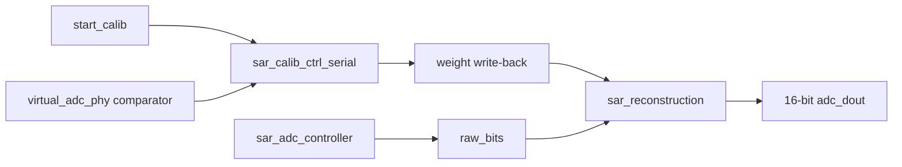

# Architecture

## Core Flow

## Calibration

`sar_calib_ctrl_serial` 从 `MAX_CALIB_BIT + 1` 开始校准高位权重。低位可信段在 reset path 中初始化，高位通过 P/N 两相 SAR 搜索、串行累加和平均写回得到。

本轮去重后，P/N 两相共享 setup、SAR 和 calc 顺序逻辑，只在比较器判决方向和最终写入 `meas_val_p/meas_val_n` 时分流。

## Reconstruction

`sar_reconstruction` 接收 `raw_bits` 和写回权重，分组求和后做缩放、四舍五入和 16-bit 饱和输出。低 6 位默认权重由 DUT reset 初始化，不依赖 testbench 层次化写 RAM。

## Top

`fpga_top_wrapper` 位于 `sources_1/new/`，是综合源文件的一部分。`sim_1/new/` 现在只放 testbench。
